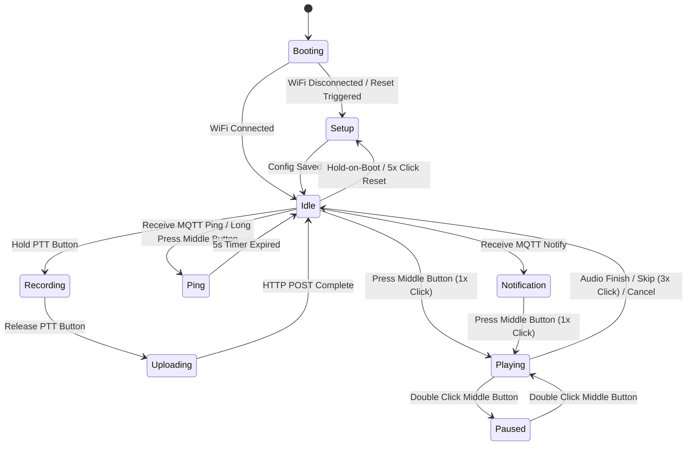

# 🐱 Product Requirements Document (PRD): Meowl
**Sistem Voicemail Asinkron Berbasis ESP32 untuk Pasangan Long Distance Relationship (LDR)**

---

## 1. Visi & Ringkasan Eksekutif (Executive Summary)

**Meowl** (*Meow* + *Mail*) adalah perangkat *Internet of Things* (IoT) interaktif berwujud *tangible UI* berbentuk kucing *kawaii* yang dirancang khusus untuk menjembatani komunikasi emosional pasangan *Long Distance Relationship* (LDR).

Berbeda dari aplikasi perpesanan instan yang serba cepat dan invasif, Meowl mengusung konsep **Komunikasi Asinkron Ephemeral**. Perangkat ini memungkinkan pasangan untuk saling mengirim pesan suara berdurasi pendek dan notifikasi emosional (*Ping Hati*) tanpa distraksi layar *smartphone*.

---

## 2. Masalah & Solusi (Problem Statement & Solution)

### 2.1 Masalah
1. **Distraksi & Kelelahan Digital (*Digital Burnout*):** Pesan obrolan (*chat*) harian sering kali tenggelam di antara notifikasi pekerjaan dan media sosial.
2. **Restriksi Jaringan Internasional:** Pasangan LDR antar-negara sering menghadapi masalah pemblokiran layanan *cloud* publik (seperti Firebase/AWS) oleh proteksi jaringan ketat regional (misalnya *Great Firewall*).
3. **Hilangnya Kehangatan Sentuhan Fisik:** Komunikasi teks tidak mampu menyampaikan nada suara dan kehadiran emosional pasangan secara intim.

### 2.2 Solusi
* **Middleman VPS Architecture:** Menggunakan server pribadi (VPS Hong Kong / Singapura) berbasis HTTP + MQTT yang bebas blokir dan berlatensi rendah.
* **Store-and-Forward Ephemeral Voice Mailbox:** Pesan disimpan lokal di SD Card dan terhapus otomatis setelah 24 jam (menciptakan urgensi & keintiman mirip *Instagram Stories*).
* **Tangible UI Kucing Kawaii:** Antarmuka fisik dengan layar OLED sebagai ekspresi emosi mata kucing.

---

## 3. Spesifikasi Perangkat Keras (Hardware Bill of Materials)

| Komponen | Spesifikasi / Tipe | Fungsi Utama | Tegangan Kerja |
| :--- | :--- | :--- | :--- |
| **Mikrokontroler** | ESP32-WROOM-32 / ESP32-WROVER | Otak pemrosesan, I2S Audio, WiFi, HTTP & MQTT client | 3.3V |
| **Input Audio** | Modul INMP441 (I2S Digital Mic) | Perekaman suara omnidirectional (Pin L/R di-GND-kan) | 3.3V |
| **Output Audio** | Modul MAX98357A (I2S DAC Amplifier) | Mengubah data audio I2S menjadi sinyal speaker | 5V (VIN) |
| **Speaker** | Mini Speaker 3W 4 Ohm | Output suara pesan | - |
| **Layar / Visual** | OLED 0.96" I2C (128x64, SSD1306) | Tampilan animasi mata, visualizer audio, & notifikasi | 3.3V |
| **Penyimpanan** | Modul MicroSD Card (SPI Interface) | Memori lokal antrean pesan `.wav` ephemeral | 3.3V |
| **Manajemen Daya**| TP4056 (USB Type-C, Proteksi LiPo) | Charger LiPo dengan proteksi overcharge & overdischarge | 5V Input |
| **Baterai** | LiPo 1 Cell 3.7V (~1000mAh) | Sumber daya portabel | 3.7V – 4.2V |

### 3.1 Konfigurasi Antarmuka Fisik (Desain 3-Tombol Minimalis)

Untuk mempertahankan estetika minimalis *casing* kucing tanpa menambah lubang tombol baru, seluruh fungsi kontrol audio, notifikasi, hingga reset perangkat dipadatkan secara cerdas menggunakan tombol multi-interaksi:

1. **Tombol Samping (Push-To-Talk / PTT):**
   * *Mekanisme:* Tactile Switch dengan *silicone paw cap*.
   * *Fungsi:* Hold untuk mulai merekam audio via INMP441; Release untuk menghentikan rekaman dan mengeksekusi HTTP POST unggah file ke VPS.
2. **Tombol Tengah (Multifungsi - Berbasis Library `OneButton`):**
   * *Mekanisme:* Tactile Switch berukuran kecil tepat di bawah layar OLED.
   * *Aksi 1x Klik (`attachClick`):* **Play / Replay**. Memutar pesan baru (`baru_*.wav`) jika ada, atau memutar ulang pesan lama (`lama_*.wav`).
   * *Aksi 2x Klik (`attachDoubleClick`):* **Pause / Resume**. Menghentikan sementara/melanjutkan streaming audio I2S tanpa membatalkan pembacaan file.
   * *Aksi 3x Klik (`attachMultiClick`):* **Skip Message**. Menghentikan file yang sedang diputar (`file.close()`) dan meloncat ke file audio berikutnya dalam antrean SD Card.
   * *Aksi Tekan Lama / > 1.5 detik (`attachLongPressStart`):* **Kirim Ping Hati**. Mengirimkan *payload* MQTT "Ping Hati" ke perangkat pasangan.
   * *Aksi Reset / 5x Klik ATAU Hold-on-Boot:* **Factory Reset & Clear Settings**. Menghapus memori Wi-Fi & NVS Preferences, lalu memicu reboot ke mode Captive Portal (`Meowl-Setup`).
3. **Saklar Utama (Power Switch):**
   * Mini Slide Switch di jalur `OUT+` TP4056 menuju `VIN` ESP32 untuk pemutusan daya baterai total.

---

## 4. Arsitektur Jaringan & Server (Middleman VPS)

```
[ ESP32: andra_cat ] <--- (Wi-Fi Local) ---> [ VPS Linux (HK/SG) ] <--- (Wi-Fi Local) ---> [ ESP32: partner_cat ]
                             │                      │
                   MQTT Broker (Mosquitto)    HTTP Server (Express.js)
                   • Notifikasi Pesan Baru    • HTTP POST /upload/:id
                   • Signal "Ping Hati"       • HTTP GET  /download/:id
```

### 4.1 Protokol Komunikasi
1. **MQTT (Eclipse Mosquitto):**
   * Topic Notifikasi: `meowl/{target_id}/notify`
   * Topic Ping: `meowl/{target_id}/ping`
   * Digunakan untuk penyampaian notifikasi instant real-time dengan konsumsi bandwidth minimal (<1KB).
2. **HTTP/REST (Node.js Express):**
   * Endpoint Upload: `POST /upload/:target_id` (Multipart Form Audio WAV)
   * Endpoint Download: `GET /download/:my_id/:filename` (Stream Audio WAV)

### 4.2 Manajemen Sesi Dinamis & Reset Mode (Captive Portal)
* Menggunakan **WiFiManager** yang dimodifikasi.
* Saat boot pertama / Wi-Fi tidak ditemukan, ESP32 membuat Access Point `Meowl-Setup`.
* **Prosedur Factory Reset (Reset Wi-Fi & Kredensial):**
  1. **Metode A (Hold-on-Boot):** Pengguna menahan Tombol Tengah selama 3 detik saat menyalakan Saklar Daya (Power Switch).
  2. **Metode B (5x Klik):** Pengguna menekan Tombol Tengah 5 kali berturut-turut saat perangkat sedang aktif.
  * ESP32 mengeksekusi `wifiManager.resetSettings()`, menghapus memori Flash `Preferences.h` (`pref.clear()`), lalu melakukan `ESP.restart()` kembali ke mode **Meowl-Setup**.
* Pengguna dapat mengonfigurasi ulang parameter melalui browser HP:
  1. Kredensial Wi-Fi (SSID & Password)
  2. **My ID** (ID Perangkat Ini, contoh: `andra_cat`)
  3. **Target ID** (ID Perangkat Pasangan, contoh: `partner_cat`)
  4. **Speaker Gain Volume** (Slider 1–100%)
* Disimpan permanen di memori Flash ESP32 menggunakan library `Preferences.h`.

---

## 5. Logika Perangkat Lunak & Lifecycle Pesan

### 5.1 Siklus Hidup Pesan & Perhitungan Indikator Unread

#### 1. Pemisahan Status di SD Card
* **Pesan Masuk (Unread):** Saat notifikasi MQTT diterima, ESP32 mengunduh file via HTTP GET dan menyimpannya di SD Card dengan penamaan `baru_[timestamp].wav`.
* **Pesan Dibaca (Read):** Setelah file diputar 1x oleh pengguna via Klik 1x Tombol Tengah, sistem secara otomatis mengubah nama file (*rename*) menjadi `lama_[timestamp].wav`.

#### 2. Perhitungan Akurat Indikator Notifikasi OLED
* Saat ESP32 memindai isi direktori SD Card, sistem **hanya menghitung file berawalan `baru_`**.
* **Contoh Kasus:**
  * Pengguna menerima 3 pesan suara baru ➔ Layar OLED menampilkan `💌 3 Pesan Baru`.
  * Pengguna mendengarkan 1 pesan ➔ File di-rename menjadi `lama_` ➔ Hitungan di OLED otomatis turun menjadi `💌 2 Pesan Baru`.
* Indikator OLED mencerminkan secara murni jumlah *Unread Messages* segar tanpa membuat pengguna bingung.

#### 3. Auto-Delete Ephemeral (24-Hour Garbage Collector)
* Saat layar dalam mode *Idle*, fungsi latar belakang memindai direktori SD Card.
* File berawalan `lama_` dengan selisih waktu `current_ntp_time - timestamp > 86400 detik` akan dihapus permanen via `SD.remove()`.

---

### 5.2 Implementasi Kode Integrasi (`OneButton` & Reset Logic)

```cpp
#include "OneButton.h"
#include "WiFiManager.h"
#include "Preferences.h"
#include "FS.h"
#include "SD.h"

#define PIN_BUTTON_CENTER 13
OneButton buttonCenter(PIN_BUTTON_CENTER, true); 

bool isPaused = false;
bool isPlaying = false;
File currentAudioFile;

void setup() {
  Serial.begin(115200);
  pinMode(PIN_BUTTON_CENTER, INPUT_PULLUP);

  // 0. Hold-on-Boot Reset Check (Menahan tombol tengah saat Power-ON)
  if (digitalRead(PIN_BUTTON_CENTER) == LOW) {
    delay(3000); // Tunggu konfirmasi 3 detik
    if (digitalRead(PIN_BUTTON_CENTER) == LOW) {
      Serial.println("⚠️ FACTORY RESET: Clearing WiFi & Preferences...");
      WiFiManager wm;
      wm.resetSettings();
      Preferences pref;
      pref.begin("meowl", false);
      pref.clear();
      pref.end();
      ESP.restart();
    }
  }

  // 1. Klik 1x: Play / Replay
  buttonCenter.attachClick(playAudio); 
  
  // 2. Klik 2x: Pause / Resume
  buttonCenter.attachDoubleClick(pauseAudio); 
  
  // 3. Klik 3x: Skip
  buttonCenter.attachMultiClick(skipAudio); 
  
  // 4. Klik 5x: Reset Settings (Saat perangkat menyala)
  buttonCenter.attachMultiClick([]() {
    if (buttonCenter.getNumberClicks() == 5) {
      Serial.println("⚠️ 5x Klik: Resetting WiFi Settings...");
      WiFiManager wm;
      wm.resetSettings();
      ESP.restart();
    }
  });

  // 5. Tekan Lama (> 1.5 detik): Kirim Ping Hati
  buttonCenter.setPressMs(1500);
  buttonCenter.attachLongPressStart(sendPing); 
}

void loop() {
  buttonCenter.tick(); // Listener aktif

  // Audio Streaming Loop Non-Blocking
  if (isPlaying && !isPaused && currentAudioFile) {
    uint8_t buffer[512];
    int bytesRead = currentAudioFile.read(buffer, sizeof(buffer));
    if (bytesRead > 0) {
      size_t bytesWritten;
      i2s_write(I2S_NUM_0, buffer, bytesRead, &bytesWritten, portMAX_DELAY);
    } else {
      currentAudioFile.close();
      isPlaying = false;
      markCurrentFileAsRead();
      updateOLEDNotificationCount();
    }
  }
}
```

---

### 5.3 UI State Machine Diagram (OLED 128x64 I2C)



---

## 6. Desain Manufaktur & Enclosure Fisik

* **Bentuk & Geometri:** Squircle (rounded square box) dengan rasio Tamagotchi retro-modern.
* **Fitur Eksterior:**
  * Telinga kucing 3D terintegrasi di bagian atas casing.
  * Cutout OLED dengan kaca akrilik transparan *flush* dengan permukaan casing.
  * Pin-hole mikrofon INMP441 & speaker grill slot bergaris di bagian bawah.
  * Cutout port USB Type-C di bagian punggung bawah.
* **Fitur Interior:**
  * Standoffs silindris M2 untuk sekrup OLED & ESP32 board.
  * Ruang kompartemen baterai LiPo 1000mAh yang aman dari getaran speaker.

---

## 7. Rencana Pengujian & Kriteria Keberhasilan

- [x] **Sub-system Audio Loopback Test:** Verifikasi INMP441 (I2S RX) dan MAX98357A (I2S TX) jernih tanpa derau.
- [x] **WiFiManager & Captive Portal Test:** Verifikasi penyimpanan parameter `My ID`, `Target ID`, & `Volume` ke NVS Flash.
- [x] **Factory Reset Verification:** Verifikasi reset Wi-Fi & NVS memori via Hold-on-Boot (3s) dan 5x Klik tombol tengah.
- [x] **OneButton Multi-click Verification:** Verifikasi keakuratan pemisahan event 1x Click, 2x Click (Pause), 3x Click (Skip), dan Long Press (Ping).
- [x] **Middleman VPS Benchmark:** Latensi pengiriman pesan suara < 3 detik di jaringan seluler/Wi-Fi antar-negara.
- [x] **24h Ephemeral Storage Garbage Collector & Unread Counter:** Verifikasi update counter `baru_*.wav` di OLED dan pembersihan otomatis file `lama_*.wav` oleh NTP scheduler.
- [x] **Visual State Machine:** Transisi animasi OLED berjalan mulus tanpa visual glitch / flicker.
