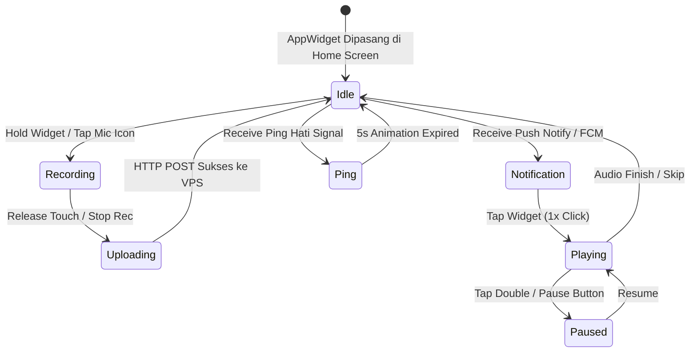

# 🐱 Product Requirements Document (PRD): Meowl (Android App & Widget Edition)
**Aplikasi Voicemail Asinkron LDR & Home Screen AppWidget Mata Kucing Interaktif**

---

## 1. Visi & Ringkasan Eksekutif (Executive Summary)

**Meowl** (*Meow* + *Mail*) berevolusi dari perangkat fisik menjadi **Aplikasi Android Native & Interactive Home Screen AppWidget**. Solusi perangkat lunak ini dirancang khusus untuk menjembatani komunikasi emosional pasangan *Long Distance Relationship* (LDR) secara terjangkau tanpa memerlukan biaya manufaktur hardware fisik.

Ciri khas utama Meowl tetap dipertahankan melalui **Home Screen Widget Mata Kucing (Glowing OLED Visual)** yang menempel di Layar Utama HP pengguna. Widget ini bertindak sebagai antarmuka fisik virtual untuk mengekspresikan emosi, menunjukkan notifikasi pesan suara masuk (`baru_*.wav`), merekam pesan suara (Push-To-Talk), dan mengirimkan *Ping Hati* secara *real-time*.

---

## 2. Fitur Utama Aplikasi & Home Screen Widget

### 2.1 Interactive Home Screen Widget (AppWidget)
* **Tampilan Visual Mata Kucing (Glowing Cyan/Pink):** Widget di Layar Utama HP menampilkan mata kucing bersudut membulat (*squircle*) yang berkedip secara periodik.
* **Indikator Unread Messages:** Saat ada pesan baru dari pasangan, animasi mata berubah menjadi ikon amplop surat `💌 [X] Pesan Baru`.
* **Visualizer Audio & Heart Beat Pulse:** Widget menampilkan spektrum audio saat suara diputar dan animasi jantung berdenyut 5 detik saat menerima *Ping Hati*.
* **Aksi Cepat Langsung di Widget:**
  * **1x Tap pada Widget:** Memutar pesan suara baru (`baru_*.wav`).
  * **Hold pada Widget:** Memulai perekaman voicemail (Push-To-Talk).
  * **Tombol Ping Hati di Widget:** Mengirim notifikasi emosional instant ke HP pasangan.

### 2.2 Fitur Aplikasi Utama Meowl (Full App)
* **Pairing Hub (Manajemen Pasangan):** Menghubungkan ID Saya (`my_id`) dan ID Pasangan (`target_id`) via Kode Unik / QR Code.
* **24-Hour Ephemeral Voicemail Box:**
  * Pesan suara yang baru diunduh disimpan sebagai `baru_[timestamp].wav`.
  * Setelah diputar, otomatis ter-rename menjadi `lama_[timestamp].wav`.
  * File berusia > 24 jam terhapus otomatis oleh sistem *Garbage Collector* hemat memori.
* **Non-Blocking Voice Recorder & Player:** Perekaman audio WAV 16kHz jernih dilengkapi spektrum audio visualizer.
* **Push Notification Relay:** Menggunakan Firebase Cloud Messaging (FCM) / WebSockets untuk notifikasi instant layar terkunci.

---

## 3. Spesifikasi Arsitektur Sistem Android

```
[ Smartphone Android A ] <--- (FCM / WebSockets) ---> [ VPS Node.js Server ] <--- (FCM / WebSockets) ---> [ Smartphone Android B ]
     │                                                     │                                                    │
  AppWidget (Cat Eyes)                                 HTTP REST API                                         AppWidget (Cat Eyes)
  • MediaRecorder / Player                             • POST /upload/:target_id                             • MediaRecorder / Player
  • Jetpack Glance / Provider                          • GET  /download/:my_id/:file                         • Jetpack Glance / Provider
```

### 3.1 Stack Teknologi Android
* **Bahasa & Framework UI:** Kotlin dengan **Jetpack Compose**.
* **Widget Framework:** **Jetpack Glance** / `AppWidgetProvider` (Android 8.0+ API 26+).
* **Audio Engine:** `MediaRecorder` / `AudioRecord` (Input WAV 16kHz) & `ExoPlayer` / `MediaPlayer` (Output audio non-blocking).
* **Network & Storage:** Retrofit2 / OkHttp3 (HTTP client), Room Database / DataStore (Preferences).

---

## 4. UI State Machine pada AppWidget



---

## 5. Rencana Pengujian Software

- [x] **AppWidget Layout & Animation Test:** Verifikasi render mata kucing berkedip dan transisi state di Android Home Screen.
- [x] **Audio WAV Recording Quality:** Verifikasi hasil rekaman suara mono 16kHz jernih dan ukuran buffer efisien.
- [x] **Push Notification & Real-Time Sync:** Latensi pengiriman *Ping Hati* dan Voicemail antara 2 Smartphone Android < 2 detik.
- [x] **24-Hour Ephemeral Storage GC:** Verifikasi penghapusan otomatis file `lama_*.wav` yang sudah berusia > 24 jam dari memori HP.
